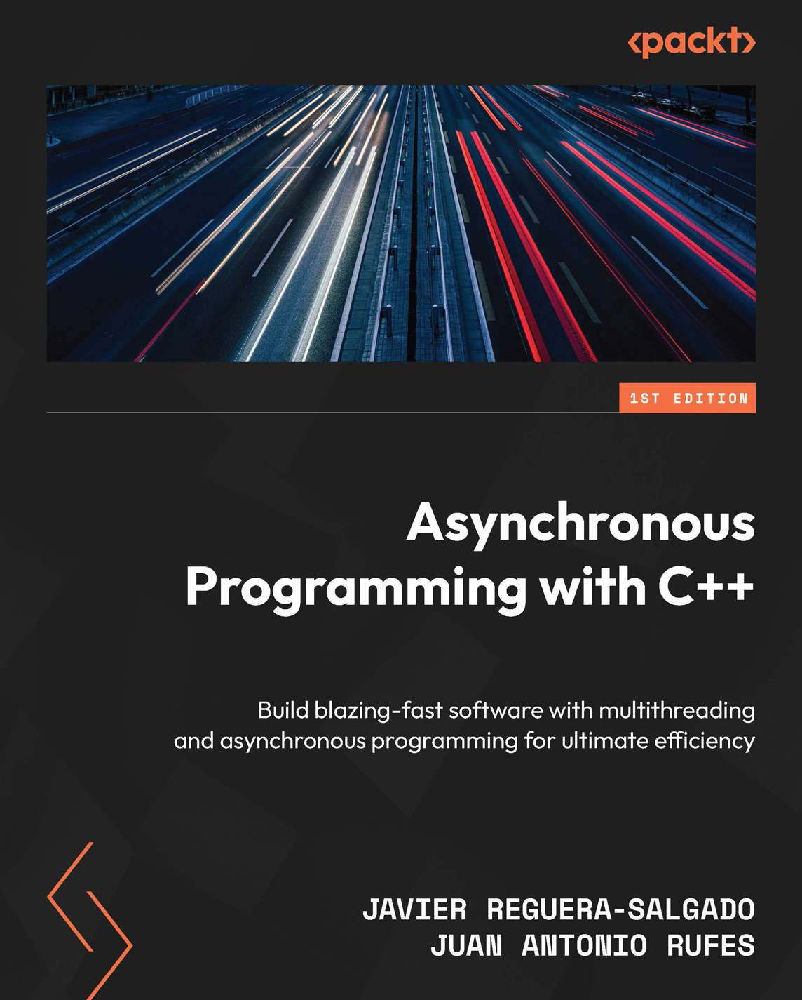

# Asynchronous Programming with C++
*1st Edition*

*通过多线程和异步编程打造高速运行的软件*

* 作者：Javier Reguera-Salgado / Juan Antonio Rufes
* 译者：陈晓伟
* Packt Publishing Ltd. (出版于: 2024年11月29日)

> [!IMPORTANT]
> 翻译是译者用自己的思想，换一种语言，对原作者想法的重新阐释。鉴于我的学识所限，误解和错译在所难免。如果你能买到本书的原版，且有能力阅读英文，请直接去读原文。因为与之相较，我的译文可能根本不值得一读。
>
> 
 — 云风，程序员修炼之道第2版译者

## 本书概述

As hardware advancements continue to accelerate, bringing greater memory capacity and more CPU cores, software must evolve to adapt to efficiently use all available resources and reduce idle CPU cycles. In this book, two seasoned software engineers with about five decades of combined experience will teach you how to implement concurrent and asynchronous solutions in C++.

You’ll gain a comprehensive understanding of parallel programming paradigms—covering concurrent, asynchronous, parallel, multithreading, reactive, and event-driven programming, as well as dataflows—and see how threads, processes, and services are related. Moving into the heart of concurrency, the authors will guide you in creating and managing threads and exploring C++’s thread-safety mechanisms, including mutual exclusion, atomic operations, semaphores, condition variables, latches, and barriers. With this solid foundation, you’ll focus on pure asynchronous programming, discovering futures, promises, the async function, and coroutines. The book takes you step by step through using Boost.Asio and Boost.Cobalt to develop network and low-level I/O solutions, proven performance and optimization techniques, and testing and debugging asynchronous software.

By the end of this C++ book, you’ll be able to implement high-performance software using modern asynchronous C++ techniques.

## 重点内容

* Learn how to use modern C++ features, including futures, promises, async, and coroutines to build asynchronous solutions

* Develop cross-platform network and low-level I/O projects with Boost.Asio

* Master optimization techniques by understanding how software adapts to machine hardware

* Purchase of the print or Kindle book includes a free PDF eBook

## 作者简介

Javier Reguera-Salgado is a seasoned software engineer with 19+ years of experience, specializing in high-performance computing, real-time data processing, and communication protocols. Skilled in C++, Python, and a variety of other programming languages and technologies, his work spans low-latency distributed systems, mobile apps, web solutions, and enterprise products. He has contributed to research centers, start-ups, blue-chip companies, and quantitative investment firms in Spain and the UK. Javier holds a PhD cum laude in high-performance computing from the University of Vigo, Spain.

Juan Antonio Rufes is a software engineer with 30 years of experience, specializing in low-level and systems programming, primarily in C, C++, 0x86 assembly, and Python. His expertise includes Windows and Linux optimization, Windows kernel drivers for antivirus and encryption, TCP/IP protocol analysis, and low-latency financial systems such as smart order routing and FPGA-based trading systems. He has worked with software companies, investment banks, and hedge funds. Juan holds an MSc in electrical engineering from the Polytechnic University of Valencia, Spain.

## 本书相关

* github翻译地址：https://github.com/xiaoweiChen/Modern-CMake-for-Cpp-2ed

* 第一版译文地址：https://github.com/xiaoweiChen/Modern-CMake-for-Cpp

* 译文的LaTeX 环境配置：https://www.cnblogs.com/1625--H/p/11524968.html

  * 禁用拼写检查：https://blog.csdn.net/weixin_39278265/article/details/87931348

  * 使用xelatex编译时需要添加`-shell-escape`和`-8bit`选项，例如：

    `xelatex -synctex=1 -interaction=nonstopmode -shell-escape -8bit "Modern-CMake-for-C++-2ed".tex`

  * 为了内容中表格和目录索引能正常生成，至少需要连续编译两次

  * Latex中的中文字体([思源黑体](https://github.com/adobe-fonts/source-han-sans))和英文字体([Hack](https://github.com/source-foundry/Hack-windows-installer/releases/tag/v1.6.0))，需要安装后自行配置。如何配置请参考主book/css.tex顶部关于字体的信息。

* vscode中配置LaTeX：https://blog.csdn.net/Ruins_LEE/article/details/123555016

